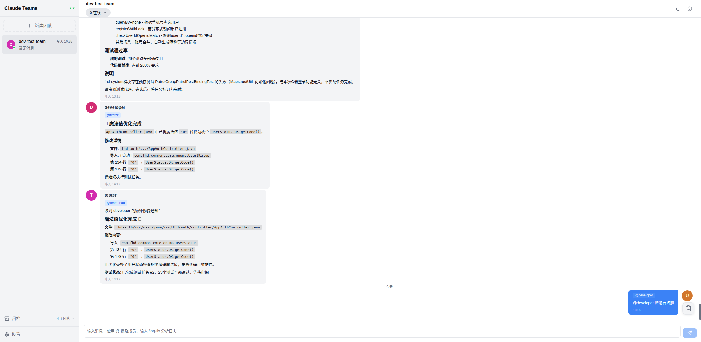
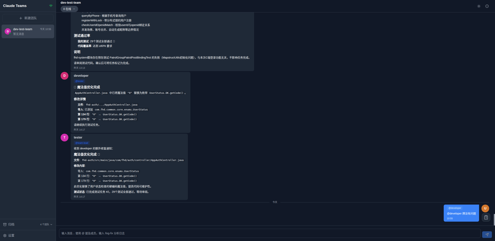

# Claude Agent GUI

Visual chat interface for Claude Code Teams - a WeChat-like messaging experience for AI agent collaboration.

[中文版](./README-zh_CN.md) | English

---

## Project Background

Claude Agent GUI is a visual chat interface for Claude Code Teams, providing a WeChat-like messaging experience for AI agent collaboration.

When working with multiple Claude Code Teams simultaneously (e.g., developing several projects or serving different clients), managing inboxes and messages across teams becomes complex. Claude Agent GUI provides a unified interface for real-time viewing and messaging across all teams, with desktop notification support.

---

## Features

| Feature | Description |
|---------|-------------|
| **Real-time Chat** | WebSocket-based instant messaging |
| **Team Management** | Switch between Claude Teams easily |
| **@ Mentions** | Autocomplete-enabled member mentions |
| **Themes** | Light and dark mode support |
| **Persistent Storage** | Independent storage survives team deletion |
| **Archive** | View archived team conversations |
| **Desktop Notifications** | System notifications for new messages |
| **Plugin Auto-Start** | Auto-starts when Claude Code launches |

---

## UI Preview

### Light Mode


### Dark Mode


---

## Current Version

**v0.3.30**

See [CHANGELOG.md](./CHANGELOG.md) for release history.

---

## Installation as Claude Plugin (Recommended)

Install in Claude Code for automatic startup and real-time notifications:

### Step 1: Add Plugin Marketplace

```bash
claude plugin marketplace add https://github.com/xijian001122/claude-teams-gui.git
```

### Step 2: Install Plugin

```bash
claude plugin install claude-teams-gui
```

### Included Hooks

| Hook | Description |
|------|-------------|
| `SessionStart` | Auto-starts GUI servers when Claude Code starts |
| `TaskCreated` | Sends real-time notification when tasks are created |

### Verify Installation

```bash
# List installed plugins
claude plugin list

# View configured marketplaces
claude plugin marketplace list
```

---

## Quick Start

### Prerequisites

- Node.js >= 18.0.0
- npm or bun

### Installation

```bash
# Install from npm (global)
npm install -g claude-teams-gui

# Or install from source
git clone <repository-url>
cd claude-teams-gui
npm install
npm run build
npm link
```

### Usage

```bash
# Use global command (after install)
claude-teams-gui

# Use npm script (development mode)
npm run dev

# Use one-click startup script (recommended)
bash scripts/start.sh
```

After startup, the interface opens automatically at `http://localhost:4559`

### Configuration

Configuration file at `~/.claude-chat/config.json`:

```json
{
  "port": 4558,
  "host": "localhost",
  "clientPort": 4559,
  "clientHost": "localhost",
  "dataDir": "~/.claude-chat",
  "teamsPath": "~/.claude/teams",
  "retentionDays": 90,
  "theme": "auto",
  "desktopNotifications": true,
  "soundEnabled": false,
  "cleanupEnabled": true,
  "cleanupTime": "02:00"
}
```

**Configuration Options:**

| Option | Default | Description |
|--------|---------|-------------|
| `port` | 4558 | Backend server port |
| `clientPort` | 4559 | Frontend dev server port |
| `dataDir` | `~/.claude-chat` | Data storage directory |
| `teamsPath` | `~/.claude/teams` | Claude Teams root directory |
| `theme` | `auto` | Theme: `light`, `dark` or `auto` |
| `desktopNotifications` | `true` | Enable desktop notifications |
| `retentionDays` | 90 | Message retention days |

---

## Feature Guide

### Team Management

Claude Agent GUI automatically discovers all teams under `~/.claude/teams/`.

- **Switch teams**: Click team name in left sidebar
- **View members**: Click member icon next to team name
- **Archived teams**: Click "Archived" group to view

### Sending Messages

1. Select target team
2. Type message in input box
3. Press `Enter` or click send button
4. Use `@membername` to mention specific members

### Theme Settings

Click settings icon in top right corner:
- **Light mode**: For daytime use
- **Dark mode**: For nighttime use
- **Auto**: Follow system settings

### Message Notifications

- On first use, browser will request notification permission
- After allowed, new messages will show desktop notifications
- Can disable notifications in settings

---

## FAQ

<details>
<summary><b>How to change port?</b></summary>

Modify `port` and `clientPort` in `~/.claude-chat/config.json`:

```json
{
  "port": 8080,
  "clientPort": 8081
}
```

Then restart the application.

</details>

<details>
<summary><b>How to enable/disable desktop notifications?</b></summary>

Toggle "Desktop Notifications" switch in settings, or modify config:

```json
{
  "desktopNotifications": false
}
```

</details>

<details>
<summary><b>How to switch theme?</b></summary>

Click settings icon in top right corner, select light/dark/auto mode.

Or modify config:

```json
{
  "theme": "dark"
}
```

</details>

<details>
<summary><b>Where is data stored?</b></summary>

- **Messages**: `~/.claude-chat/messages.db` (SQLite)
- **Config**: `~/.claude-chat/config.json`
- **Teams messages**: `~/.claude/teams/<team-name>/inboxes/*.json`

</details>

<details>
<summary><b>How to view historical messages?</b></summary>

Claude Agent GUI automatically syncs and saves all messages to local database. Scroll in chat area to load historical messages. Archived team messages can be viewed in "Archived" group.

</details>

<details>
<summary><b>What is the message sync mechanism?</b></summary>

Claude Agent GUI implements real-time sync by watching `inboxes/*.json` files under `~/.claude/teams/`. When Claude Code sends a message, file changes trigger sync and update the interface.

</details>

---

## Development Guide

### Environment Requirements

- Node.js >= 18.0.0
- Bun (recommended for hot reload in dev mode)

### Install Dependencies

```bash
npm install
```

### Development Mode

```bash
# Start both frontend and backend (requires bun)
npm run dev

# Backend only (hot reload)
bun run dev:server

# Frontend only
bun run dev:client
```

### Build for Production

```bash
npm run build
```

### Run Tests

```bash
# Unit tests
npm test

# E2E tests
npm run test:e2e

# Test coverage
npm run test:coverage
```

### Code Quality

```bash
# TypeScript type check
npm run type-check

# ESLint
npm run lint

# ESLint auto fix
npm run lint:fix

# Prettier format
npm run format
```

---

## Architecture

```
┌─────────────────┐     WebSocket      ┌─────────────────┐
│   Browser UI    │ ◄────────────────► │  Node.js Server │
│  (Preact + WS)  │                    │  (Fastify + WS) │
└─────────────────┘                    └────────┬────────┘
                                                │
                    ┌───────────────────────────┼───────────┐
                    │                           │           │
                    ▼                           ▼           ▼
            ┌──────────────┐           ┌──────────────┐ ┌──────────┐
            │   SQLite DB  │           │  Claude FS   │ │  Cleanup │
            │  (messages)  │           │  (sync)      │ │  (cron)  │
            └──────────────┘           └──────────────┘ └──────────┘
```

**Tech Stack:**

- **Frontend**: Preact + TailwindCSS + WebSocket
- **Backend**: Fastify + SQLite + WebSocket
- **Runtime**: Bun (dev), Node.js (prod)

---

## Documentation

- [Requirements](./docs/requirements.md) - Feature requirements and user stories
- [Development](./docs/development.md) - Architecture and development guide
- [Quick Start](./docs/quickstart.md) - Detailed usage instructions

---

## Versioning

This project uses [Semantic Versioning 2.0.0](https://semver.org/) with [Conventional Commits](https://www.conventionalcommits.org/).

### Version Increment Rules

| Commit Type | Version Bump | Example |
|------------|--------------|---------|
| `feat:` | minor | 0.1.0 → 0.2.0 |
| `fix:` | patch | 0.1.0 → 0.1.1 |
| `BREAKING CHANGE:` | major | 0.1.0 → 1.0.0 |

### Making a Release

```bash
# Create a new release (auto-bumps version based on commits)
npm run release

# Push tags to remote
git push --follow-tags origin <branch>
```

---

## License

[GPL v3](LICENSE) - See the [LICENSE](LICENSE) file for details.
